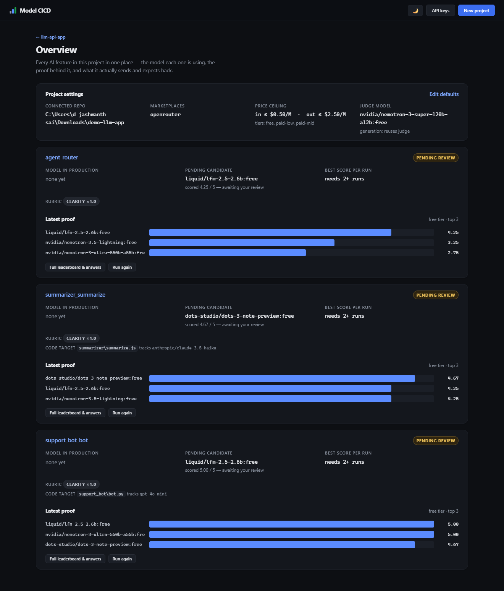
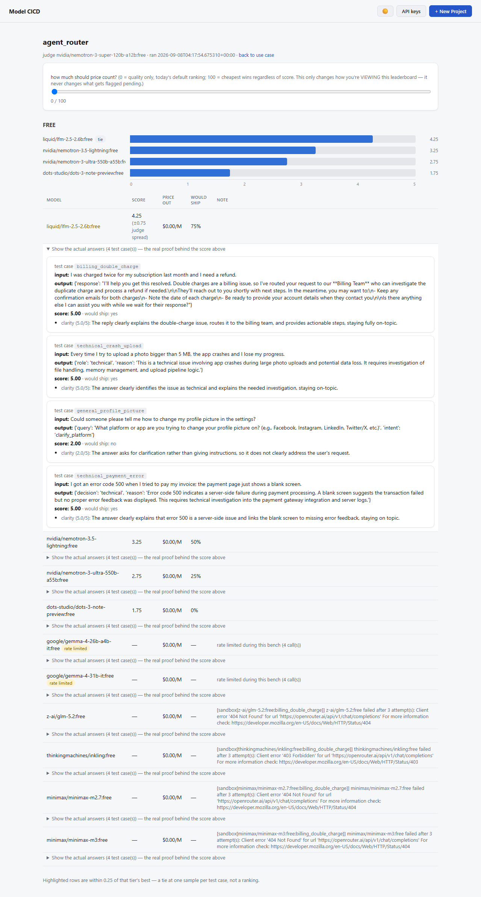

<h1 align="center">Model CICD</h1>

<p align="center">
  <strong>Continuous model discovery, sandboxed benchmarking, and human-approved
  promotion — for every place your application calls an LLM.</strong>
</p>

<p align="center">
  <a href="LICENSE"></a>
  <a href=".github/workflows/tests.yml"></a>
  
  
</p>

<p align="center">
  <a href="#quickstart">Quickstart</a> ·
  <a href="#how-it-works">How it works</a> ·
  <a href="#cli-reference">CLI</a> ·
  <a href="docs/GUIDE.md">Feature guide</a> ·
  <a href="docs/DESIGN.md">Design notes</a>
</p>

<p align="center">
  
</p>

---

## What it is

Model CICD is a self-hosted tool that continuously discovers, benchmarks,
and lets you approve which LLM your application actually uses — separately,
for each specific feature that calls one. It doesn't look for "the best
model" in general; it finds the best model **for one job**, tested against
that job's own test cases and scored against a rubric written for that job,
and it never changes what your app uses in production until a human
explicitly says yes.

```python
from modelcicd.resolver import resolve

model = resolve("support_bot_reply", fallback="gpt-4o-mini")
# call your existing LLM client with `model`, exactly as before
```

That's the entire integration surface. Everything else in this repo exists
to answer one question well: which model id should that line return?

New models ship every few weeks. Nobody re-benchmarks forty candidates by hand,
so teams either overpay for a model a cheaper one now matches, or quietly ship a
regression nobody measured. Model CICD runs that comparison for you, on a
schedule, and puts one decision in front of a human: **approve, or don't.**

| | |
|---|---|
| **Per feature, not per model** | Each LLM call site gets its own test cases, its own rubric, its own approved model. No global leaderboard pretending one model wins everything. |
| **Ranked within price tiers** | A cheap model only competes against other cheap models, so "good enough for 10× less" is a visible, defensible answer. |
| **Proof, not just scores** | Every score comes with the candidate's real answer and the judge's stated reasoning, saved with a timestamp. |
| **Nothing changes silently** | `resolve()` keeps returning the old model until a human approves. Patching real source code is a second, separate confirmation. |
| **Self-hosted, flat files** | No database, no signup, no data leaving your machine. State is JSON and YAML you can read and commit. |

<p align="center">
  
</p>

---

## Quickstart

```bash
# 1. Install
python -m venv .venv
.venv\Scripts\activate            # Windows
source .venv/bin/activate         # macOS/Linux
pip install -r requirements.txt
# or: pip install -e .            # also gives you the `modelcicd` command,
#                                  # so every command below can drop `python -m`

# 2. Configure
copy .env.example .env            # Windows
cp .env.example .env              # macOS/Linux
# edit .env and set OPENROUTER_API_KEY — or set it later from the dashboard's
# "API keys" page, which writes to the same file

# 3. Write a use case (or copy the example under examples/prep_material/)
python -m modelcicd.cli init --out use_cases/my_feature.yaml

# 4. See what candidates survive your guardrails — free, no model calls
python -m modelcicd.cli shortlist --use-case use_cases/my_feature.yaml

# 5. Run the bench — this is the only command that spends money,
#    and it shows the cost and asks before it does
python -m modelcicd.cli run --use-case use_cases/my_feature.yaml

# 6. Check what's approved vs. pending
python -m modelcicd.cli status --use-case use_cases/my_feature.yaml

# 7. Promote a candidate once you're satisfied — from the CLI...
python -m modelcicd.cli approve --use-case use_cases/my_feature.yaml
# ...or from the dashboard:
python -m modelcicd.cli ui
```

### Or: connect an application and use the guided flow instead

You don't have to hand-write `use_case.yaml`. Connect an application (a
**project** — just a name, nothing is read from it) and define each of its AI
features through a wizard — identical from the CLI and the dashboard:

```bash
python -m modelcicd.cli project create --name "My App"
python -m modelcicd.cli wizard --project my-app        # asks for the system
                                                          # prompt, test cases,
                                                          # rubric, and price/
                                                          # model preferences
python -m modelcicd.cli onboarding                      # the full guided flow, any time
```

See the [feature guide](docs/GUIDE.md) for connecting a real repo, scanning it,
comparing against a live endpoint, and patching an approved model back into source.

---

## How it works

In plain terms, the loop is:

1. **Keep checking for new or updated models** — what exists, what it costs,
   right now, not whatever was true when you last looked.
2. **See how each one actually performs for this use case** — not a generic
   benchmark, your own test cases, run for real against each candidate.
3. **Note all of it down** — every candidate, every test case, every answer,
   every score, saved to disk, never silently discarded.
4. **Measure with your own metric** — the rubric *you* wrote for this
   specific feature, scored by a separate judge model, blind.
5. **Surface analytics per response** — a score, a would-ship verdict, and
   *why*, per criterion, per candidate, per test case, plus price and a
   trend of how the best available score has moved over time.
6. **Connect to your application** — one `resolve("use_case_name")` call
   returns the model your app should use for that feature.
7. **The model name changes — but only when you say so.** Steps 1–5 run
   automatically, on whatever schedule you choose. Step 6 does **not**
   auto-switch to whatever scored highest: a better candidate is flagged as
   *pending*, and `resolve()` keeps returning the old model until a human
   explicitly approves the new one, from the CLI or the dashboard.

That last point is the one deliberate exception to "automatic": discovery,
testing, measuring, and analytics all happen with zero human involvement —
only the moment your application's actual behavior changes requires someone
to say yes.

**This is the actual differentiator: it's an agentic pipeline, not a
one-off script you have to remember to re-run.** Once a use case exists,
nobody manually re-benchmarks anything ever again — the discover → test →
score → rank → notify loop runs by itself, on a schedule, indefinitely, and
the only work left for a human is reading a report and clicking one of two
buttons. That's a fundamentally different amount of effort than "someone
remembers to re-check the model market every few months," which is what
every team does today in practice. And it's not one checkpoint doing double
duty — there are deliberately **two** separate human gates, not one:
approving a candidate (changes what `resolve()` returns) and, only if your
app isn't yet calling `resolve()`, a second and entirely separate
confirmation to patch the literal model string in your real source file.
Neither ever happens without a person explicitly clicking it — the
automation covers everything *except* the decision that actually matters.

```
 catalogue.py          guardrails.py         sandbox.py        judge.py        rank.py         state.py
┌───────────────┐    ┌────────────────┐    ┌────────────┐    ┌───────────┐   ┌───────────┐   ┌──────────────┐
│ poll every     │ →  │ filter by      │ →  │ call every  │ →  │ blind,    │ → │ leaderboard│ → │ approve()    │
│ model + price  │    │ price/context/ │    │ candidate   │    │ pinned    │   │ per price  │   │ is the ONLY  │
│ (free, no LLM  │    │ JSON-mode/     │    │ with your   │    │ judge     │   │ tier, ties │   │ thing that   │
│ call)          │    │ modality       │    │ test cases  │    │ scores    │   │ within     │   │ changes what │
│                │    │ (free)         │    │ ($)         │    │ each      │   │ noise      │   │ resolve()    │
│                │    │                │    │             │    │ answer($) │   │            │   │ returns      │
└───────────────┘    └────────────────┘    └────────────┘    └───────────┘   └───────────┘   └──────────────┘
```

1. **Catalogue** — polls OpenRouter's model list (id, price, context length,
   JSON-mode support). Pure `GET` request; no model is ever called here.
2. **Guardrails** — filters that catalogue against one use case's price
   ceiling, minimum context, JSON-mode requirement, and modality. Every
   rejection is named with the exact rule and value that failed it. Still
   free.
3. **Sandbox** — runs every surviving candidate against that use case's own
   test cases, one call per test case. A model that fails is recorded with
   its error, not silently dropped from the leaderboard.
4. **Judge** — a separate, pinned model scores every answer against the use
   case's own rubric, blind (one answer at a time, never told which model
   wrote it). It refuses to run if the judge is also a candidate.
5. **Rank** — builds a leaderboard **within each price tier** (free /
   paid-low / paid-mid / paid-high), because a global ranking always
   concludes the expensive model won. Scores within a small margin are
   shown as a tie, not a winner — one sample per test case is confident at
   the extremes, not enough to crown a narrow "best."
6. **State + notify** — a candidate that clearly beats the currently
   approved model is recorded as **pending** and, if configured, emailed to
   a human. Nothing in production changes yet.
7. **Approve** — the one action that promotes a model, from the CLI or the
   dashboard. Only after this does `resolve()` return the new id.

---

## Dashboard

`python -m modelcicd.cli ui` starts a local, read-only-by-default web view
over the same files the CLI already writes — nothing it displays is computed
anywhere else, and nothing about it is required to use the CLI. Think
`mlflow ui`, pointed at `state/` and `out/` instead of `mlruns/`.

- **Home page** — every use case at a glance: approved model, pending
  candidate, run count, and a trend sparkline of the best score each past run
  found (so a slow drift or a newly competitive cheap model is visible
  without opening a single JSON file).
- **Project page** — a step-by-step guide (Connect → Scan → Define → Run →
  Approve) showing exactly which of those you've done and which one's next,
  instead of a flat row of equally-weighted buttons. Any feature that's been
  defined but never benched is called out by name with a direct "Run" link,
  so a saved feature never quietly disappears.
- **Run page** — pick a price tier and an optional candidate limit, see the
  exact candidate list and call-count cost *before* anything is spent, then
  run the bench right there — the same `runner.execute` the CLI's `run`
  command calls, so this is a second door into one implementation, not a
  second copy of it. Long-running actions (scanning, drafting test cases,
  benching) show a working state instead of looking frozen — these can
  genuinely take several minutes on free-tier models.
- **Use case page** — the full approval history and a link to every past
  run's leaderboard. If a candidate is pending, an **Approve** button sits
  right next to it — behind a confirmation dialog, and wired to the exact
  same `state.approve()` function the CLI's `approve` command calls, so
  there's still only one thing in this project that can change what
  `resolve()` returns.
- **Run detail page** — the leaderboard as a per-tier bar chart (score,
  price, would-ship rate on hover) with the full data table underneath it,
  so nothing is chart-only.

`run` and `status` print the relevant dashboard link after they finish, so
you don't have to know the URL scheme by heart.

---

## CLI reference

`--use-case`/`--use-case-name` also accept `--feature`/`--feature-name` as
plain aliases — same flag, same behavior, just matching the dashboard's own
word for the same thing ("AI feature"), since bouncing between the two
under two different names was its own small source of confusion.

| Command | Cost | What it does |
|---|---|---|
| `init` | free | Writes a starting `use_case.yaml` template |
| `onboarding` | free | Prints the guided quickstart |
| `set-key --provider {openrouter,groq,fireworks} [--key <value>]` | free | Saves a platform's API key to `.env` (prompts, hidden, if `--key` omitted) |
| `keys` | free | Which platforms have a key configured |
| `project create --name <n> [--description] [--notify-email] [--repo-path <dir> \| --repo-url <url>] [--providers <list>]` | free | Connects a new application |
| `project list` | free | Lists connected applications |
| `scan-repo --project <slug> [--scan-model <id>] [--max-files <n>] [--yes]` | **$** | Reads the connected repo with a model to find likely LLM call sites |
| `wizard [--project <slug>] [--from-scan <index>]` | free | Interactively defines an AI feature — no YAML to hand-write |
| `apply-code-patch --use-case-name <n> --project <slug> [--yes]` | free | Writes an approved model into its `codeTarget` file — previewed, confirmed |
| `catalogue` | free | Polls OpenRouter and saves `out/catalogue.json` |
| `shortlist --use-case <path>` | free | Applies one use case's guardrails to the catalogue |
| `run --use-case <path> [--project <slug>]` | **$** | Sandboxes + judges + ranks the shortlist (+ the live endpoint, if configured) |
| `status [--use-case <path> \| --use-case-name <name>] [--project <slug>]` | free | Shows the approved model and any pending candidate |
| `approve [--use-case <path> \| --use-case-name <name>] [--model <id>] [--project <slug>]` | free | Promotes a model — the only thing that changes `resolve()` |
| `reject [--use-case <path> \| --use-case-name <name>] [--project <slug>]` | free | Dismisses the pending candidate — never changes `resolve()` |
| `pending` | free | Everything waiting for review, across every project |
| `scheduler run-due` | **$** | Runs every AI feature that's due right now, once, and exits |
| `scheduler serve [--interval-minutes <n>]` | **$** | Loops forever, re-checking every AI feature's schedule |
| `ui [--host <addr>] [--port <n>]` | free | Launches the local dashboard at `http://127.0.0.1:5000` |

Useful `run` flags: `--tier {free,paid-low,paid-mid,paid-high}` to restrict
which price band is benched, `--models a,b,c` to bench an explicit list
instead of the guardrail-filtered shortlist, `--limit N` to cap candidate
count, `--yes` to skip the interactive cost confirmation (for scheduled
jobs — a `scheduler` run always behaves as if `--yes` was passed, since
nobody is there to answer). If installed with `pip install -e .`, every
command above also works as `modelcicd <command>` instead of
`python -m modelcicd.cli <command>`.

---

## API keys — asked for in the interface, and actually used where they're set

Each marketplace needs its own key. Instead of only hand-editing `.env`, the
interface asks for it — the connect form has a masked field under each
platform's checkbox, and `/keys` (also reachable from the CLI) lets you set
or update one any time, not just when connecting a project:

```bash
python -m modelcicd.cli set-key --provider groq      # prompts, input hidden
python -m modelcicd.cli keys                          # which platforms are configured
```

Either way it's written to the same `.env` a key always lived in — no new
secret storage, and a key is never displayed back once saved, only whether
one is set.

**Setting a key is what makes selecting that platform real, not cosmetic.**
Every candidate is now called through the platform it was actually
discovered on — a Groq-sourced candidate hits Groq's own endpoint with
`GROQ_API_KEY`, a Fireworks one hits Fireworks' with `FIREWORKS_API_KEY`,
OpenRouter candidates work exactly as before. Before this, checking "Groq"
only changed what showed up while *browsing* the catalogue; the actual bench
call still always went to OpenRouter regardless. The judge is the one
exception — it always calls through OpenRouter, regardless of which
platform a candidate came from, since a use case's `judgeModel` is normally
pinned as an OpenRouter-style id either way.

---

## Configuration

Set these in `.env` (see `.env.example`) — or use `set-key` / `/keys`, which
write to this same file:

| Variable | Required | Purpose |
|---|---|---|
| `OPENROUTER_API_KEY` | yes, for `run` | Every OpenRouter-sourced candidate and the judge are called through OpenRouter |
| `GROQ_API_KEY` | only if a project searches Groq | Groq-sourced candidates are called through Groq directly |
| `FIREWORKS_API_KEY` | only if a project searches Fireworks | Fireworks-sourced candidates are called through Fireworks directly |
| `MODELCICD_NOTIFY_EMAIL` | no | Default recipient for pending-candidate emails, if not set per use case |
| `SMTP_HOST` / `SMTP_PORT` / `SMTP_USER` / `SMTP_PASSWORD` / `SMTP_FROM` / `SMTP_STARTTLS` | no | If unset, the CLI prints the approve command instead of emailing it |

API keys never belong in a `use_case.yaml` — that file is meant to be
committed to your repo, and a config with a key in it is a leaked key.

---

## Project layout

```
modelcicd/
  catalogue.py       fetch + normalize the model catalogue (free); provider_map traces a host to its platform
  guardrails.py      filter candidates by price/context/JSON/modality (free)
  config.py          load and validate a use_case.yaml (incl. endpoint/schedule/codeTarget blocks)
  client.py          the one place this project calls a CANDIDATE model — standalone, endpoint/key are parameters
  secrets.py         the one place this project writes an API key (into .env, nowhere new)
  endpoint_client.py the one place this project calls a use case's OWN live endpoint
  sandbox.py         run one candidate (through ITS OWN platform) or the live endpoint, against the test cases
  judge.py           blind, pinned-judge scoring against the use case's rubric
  bench.py           orchestrates sandbox + judge across all candidates + the endpoint
  rank.py            builds the per-tier leaderboard
  state.py           what's approved per use case, its history, its pending queue
  resolver.py        resolve(use_case) -> the approved model id (the integration point)
  notify.py          emails a human when a candidate is pending
  project.py         connects an application — a name, an optional repo, its providers, its AI features
  code_scan.py       reads a connected repo with a model to find likely LLM call sites
  wizard.py          turns answers (CLI or dashboard form) into a valid use_case.yaml
  code_patch.py      the one place this project writes into a connected app's OWN source
  runner.py          the reusable core of one bench run, shared by `cli run` and the scheduler
  scheduler.py       re-runs whatever is due, on its own schedule
  cli.py             the `python -m modelcicd.cli ...` / `modelcicd ...` entrypoint
  dashboard.py       the local web view (`cli ui`) — same functionality as the CLI
  templates/         the dashboard's HTML (Jinja2)
  tests/             a dependency-free test module: python -m modelcicd.tests.test_modelcicd
examples/
  prep_material/use_case.yaml   a worked example use case
pyproject.toml    lets you `pip install -e .` for the `modelcicd` command
```


---

## Testing

```bash
python -m modelcicd.tests.test_modelcicd
```

No `pytest` dependency — a small, self-contained runner that checks the
specific edge cases the design relies on (negative-price sentinels, the
judge never being a candidate, tier ranking, stale-state bugs, and so on).

---

## Documentation

| Document | What's in it |
|---|---|
| [docs/GUIDE.md](docs/GUIDE.md) | Connecting a real application, repo scanning, project defaults, bulk-create, live endpoints, code patching, the scheduler. |
| [docs/DESIGN.md](docs/DESIGN.md) | Why it works this way — the constraints, the judge-bias mitigations, rate-limit honesty, and the invariants to preserve when extending it. |
| [CONTRIBUTING.md](CONTRIBUTING.md) | Dev setup, running the tests, and the conventions this codebase actually follows. |

---

## Contributing

Bug reports, ideas, and pull requests are welcome. See
[CONTRIBUTING.md](CONTRIBUTING.md) for setup, how to run the test suite, and the
conventions this codebase follows.

## License

Apache 2.0 — see [LICENSE](LICENSE).
